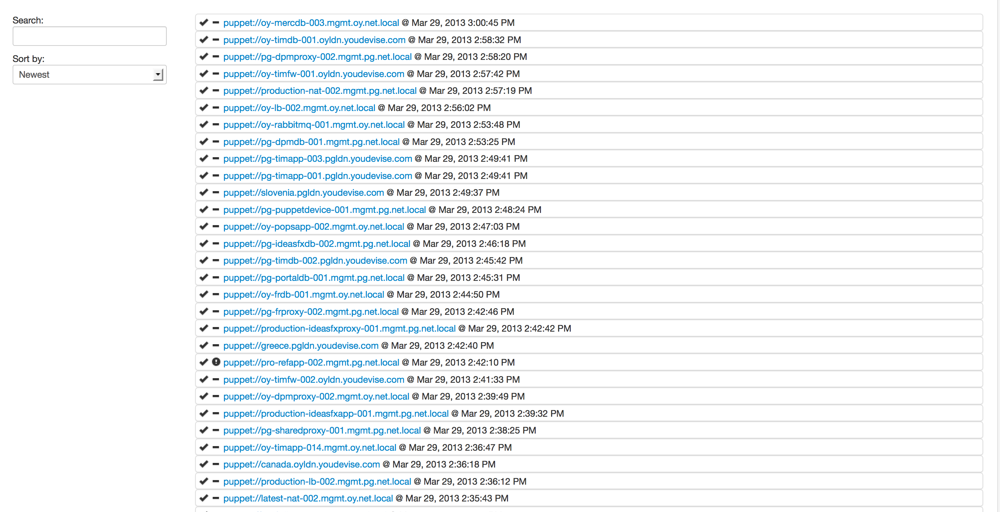
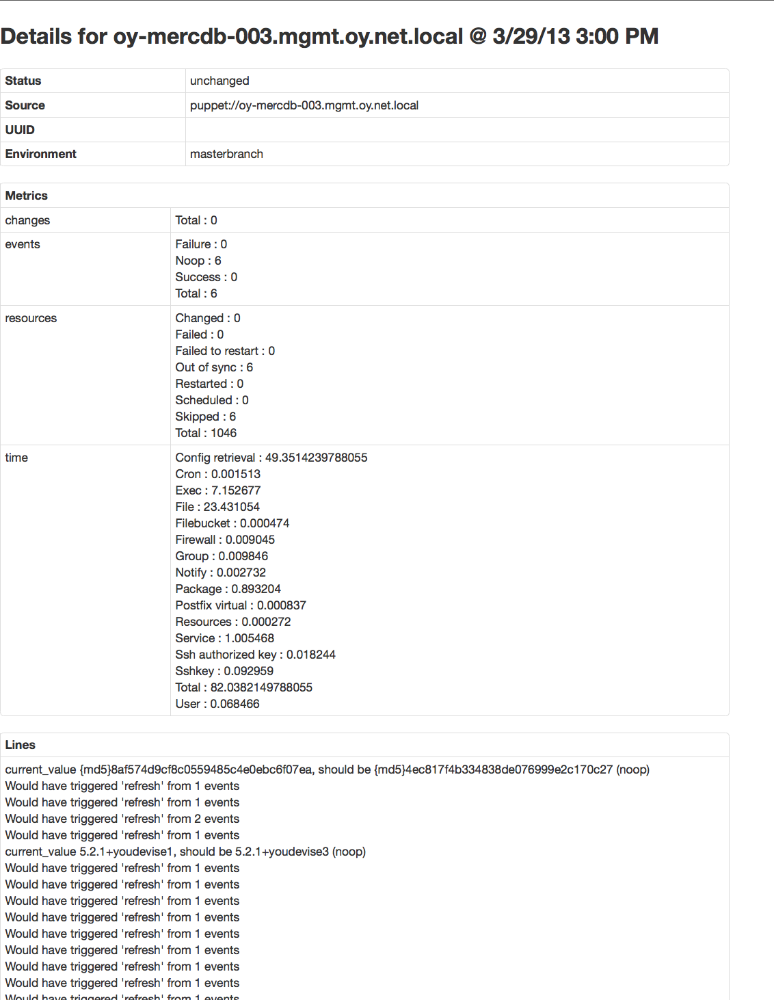

# Norman

Norman is a (very) small subset of [Foreman](http://theforeman.org/), just
for viewing puppet run reports.

## Getting reports

See [Puppet logstash reporter](https://github.com/youdevise/puppet-logstash-reporter/)

for the report you need to add to puppet.

## Munging reports

You are expected to have a rule like this in your logstash config:

    mutate {
        tags       => [ "puppet-apply" ]
        replace    => [ "@type", "puppet-apply" ]
    }

# Hosting norman

It's 100% Javascript, so just copy the app/ directory under your web root
somewhere.

It also expects Elasticsearch to be available at /es/ on the same server
you installed it on.

# Screenshots

# TODO

  * Fix the hard coded /es/ path
  * Fix the test suite
  * Add an 'other runs for this host' page
  * Fix search / ordering functionality on homepage
